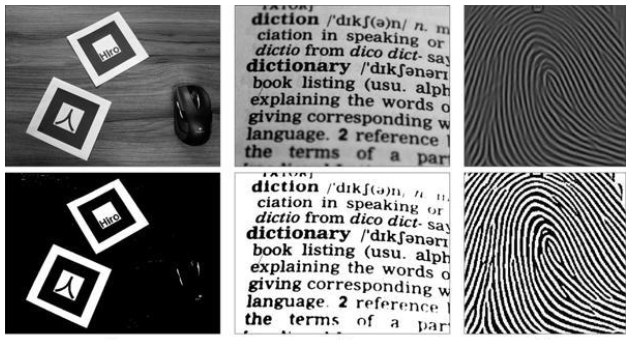
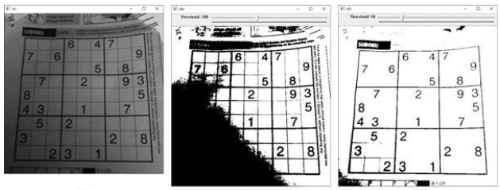

# 이진화

`각 픽셀을 두 개의 부류`로 나누는 작업   
관심 영역안 `ROI(Region Of Interest)`과 비관심 영역 분리   
0과 255로 분리하므로 보통 `흰색과 검은색`으로 구성
- 특정 임계값(Threshold) 기준으로 분리됨

**예시**



## 전역 이진화 global binarization

모든 픽셀에 같은 임계값을 적용하여 이진화를 수행하는 방식
- 영상 특성에 따라서 전역 이진화를 할 경우 문제 발생
- 균일하지 않은 조명 등의 영상에서는 객체와 배경이 분리되지 않음

**예시**



임계값 설정:


T: threshold

### threshold

[threshold(링크)](https://docs.opencv.org/master/d7/d1b/group__imgproc__misc.html#gae8a4a146d1ca78c626a53577199e9c57)


**코드:**
c++:

```cpp
double cv::threshold(InputArray src, OutputArray dst,
                     double thresh, double maxval, int type)
```

python:

```py
retval, dst = cv.threshold(src, thresh, maxval, type[, dst])
```

**예시**


### 부등호 연산자

```cpp
Mat dst = src > 128;
```

## 적응형 이진화 adaptive binarization

불균일한 조명 성분을 가진 영상에 대해 `각 픽셀마다 서로 다른 임계값`을 사용   
정해진 크기의 `사각형 블록 영역`을 설정, 블록 영역 내부의 픽셀 값 분포로부터 고유의 임계값 결정   
블록 내부 픽셀 값의 평균은 `산술 평균` 또는 `가우시안 함수를 사용한 가중 편균`을 사용

임계값 결정:


- T: threshold
- μ: (x, y) 주변 블록 영역의 픽셀 값 평균
- C: 임계값의 크기를 조정하는 상수

### adaptiveThreshold

[adaptiveThreshold](https://docs.opencv.org/master/d7/d1b/group__imgproc__misc.html#ga72b913f352e4a1b1b397736707afcde3)

**코드**

c++:

```cpp
void cv::adaptiveThreshold(InputArray src, OutputArray dst, 
                           double maxValue, 
                           int adaptiveMethod, 
                           int thresholdType, 
                           int blockSize, 
                           double C)
```

python:

```py
dst = cv.adaptiveThreshold(src, maxValue, adaptiveMethod, thresholdType, blockSize, C[, dst])
```