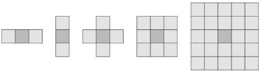
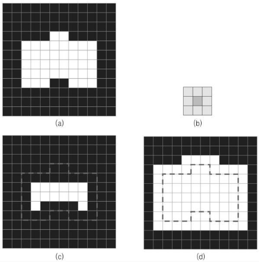
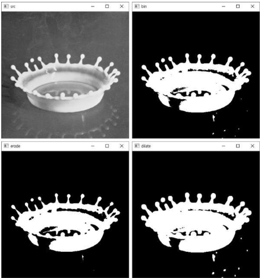
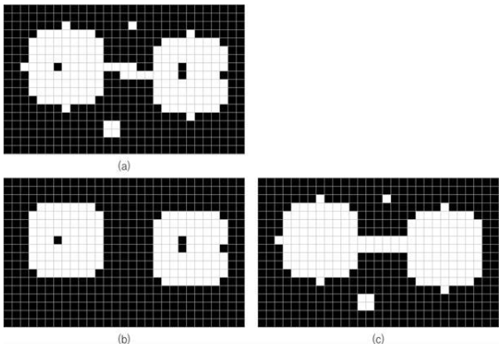
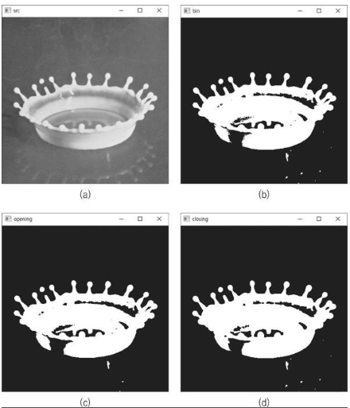

# 모폴로지 연산

영상 내부 객체의 `형태와 구조`를 분석하고 처리하는 기법   
주로 이진화된 영상에서 객체 모양을 변형하는 용도로 사용   

## 이진 영상의 침식과 팽창

구조 요소(Structuring element) 정의 후 모폴로지 연산을 정의해야 함
- 모폴로지 연산의 동작을 결정하는 작은 크기의 행렬

**예시**


기본적인 연산 기법은 `구조 요소를 영상 전체에 대해 스캔`하며 계산

- 침식(Erosion)
  - 객체 영역의 외곽을 골고루 깎아 내는 연산
  - 객체 영역 -> 축소 / 배경 -> 확대
  - 구조 요소가 객체 영역 내부에 완전히 포함된 경우, 고정점 위치 픽셀은 255로 설정
- 팽창(Dilation)
  - 객체 외곽을 확대하는 연산
  - 객체 영역 -> 확대 / 배경 -> 축소
  - 구조 요소와 객체 영역이 한 픽셀이라도 만날 경우, 고정점 위치 픽셀 = 255

**예시**


### 구조 요소 행렬

[getStructuringElement](https://docs.opencv.org/master/d4/d86/group__imgproc__filter.html#gac342a1bb6eabf6f55c803b09268e36dc)

[MorphShapes](https://docs.opencv.org/master/d4/d86/group__imgproc__filter.html#gac2db39b56866583a95a5680313c314ad)

**코드**

c++:

```cpp
Mat cv::getStructuringElement(int shape, Size ksize, Point anchor = Point(-1,-1))
```

python:

```py
retval = cv.getStructuringElement(shape, ksize[, anchor])
```

### 침식 연산

[erode](https://docs.opencv.org/master/d4/d86/group__imgproc__filter.html#gaeb1e0c1033e3f6b891a25d0511362aeb)

**코드**

c++:

```cpp
void cv::erode(InputArray src, OutputArray dst, InputArray kernel,
               Point anchor = Point(-1,-1),
               int iterations = 1,
               int borderType = BORDER_CONSTANT,
               const Scalar & borderValue = morphologyDefaultBorderValue())
```

python:

```py
dst = cv.erode(src, kernel[, dst[, anchor[, iterations[, borderType[, borderValue]]]]])
```

### 팽창 연산

[dilate](https://docs.opencv.org/master/d4/d86/group__imgproc__filter.html#ga4ff0f3318642c4f469d0e11f242f3b6c)

**코드**

c++:

```cpp
void cv::dilate(InputArray src, OutputArray dst, InputArray kernel,
                Point anchor = Point(-1,-1),
                int iterations = 1,
                int borderType = BORDER_CONSTANT,
                const Scalar & borderValue = morphologyDefaultBorderValue())
```

python:

```py
dst = cv.dilate(src, kernel[, dst[, anchor[, iterations[, borderType[, borderValue]]]]])
```

**예시**


## 이진 영상의 열기와 닫기

위의 침식과 팽창 연산을 이용하여 구현   
객체의 영역의 크기는 바뀌지 않음   
OpenCV에서는 morphologyEx()로 구현됨

- 열기(Opening): 침식 후 팽창
  - 작은 크기의 객체가 제거됨
  - MORPH_OPEN 상수 사용
- 닫기(Closing): 팽창 후 침식
  - 작은 크기의 구멍이 제거됨
  - MORPH_CLOSE 상수 사용

**예시**


### morphologyEx

[morphologyEx](https://docs.opencv.org/master/d4/d86/group__imgproc__filter.html#ga67493776e3ad1a3df63883829375201f)

**코드**

c++:

```cpp
void cv::morphologyEx(InputArray src, OutputArray dst,
                      int op, InputArray kernel,
                      Point anchor = Point(-1,-1),
                      int iterations = 1,
                      int borderType = BORDER_CONSTANT,
                      const Scalar & borderValue = morphologyDefaultBorderValue())
```

python:

```py
dst = cv.morphologyEx(src, op, kernel[, dst[, anchor[, iterations[, borderType[, borderValue]]]]])
```

**예시**
