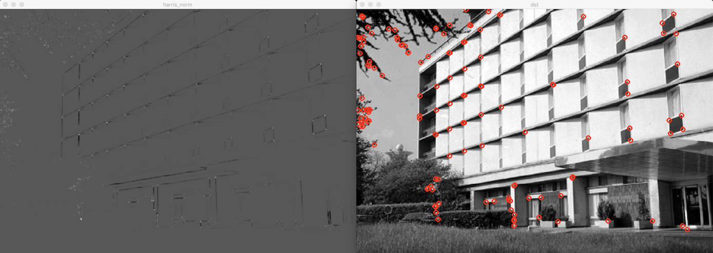
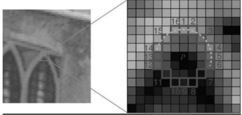
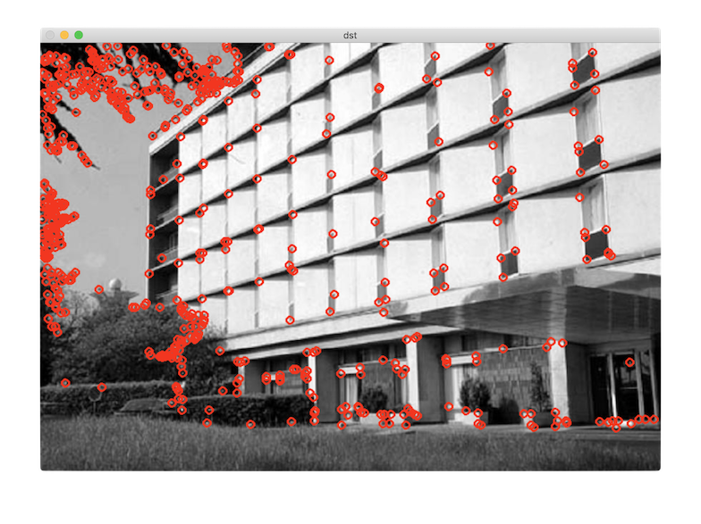

# 코너 검출

## 영상의 특징이란

`영상으로부터 추출`할 수 있는 유용한 정보   
- 평균 밝기, 히스토그램, 에지, 직선 성분, 코너 등
지역 특징(Local feature) : 영상 전체가 아닌 `일부 영역에서 추출`할 수 있는 특징 
- 에지, 직선 성분, 코너 등
  - 코너
    - 에지의 방향이 급격하게 변하는 부분 ex) 삼각형의 꼭지점, 연필 심 등
    - 다른 지역 특징에 비해 `분별력이 높고` 전 영역에 골고루 분포
    - 특징점(Feature point), 키포인트(keypoint), 관심점(interest point)라 부르기도 함

## 해리스 코너 검출

영상의 특정 위치(x, y)에서 dx와 dy만큼 떨어진 픽셀과의 밝기 차이
- 가우시안 형태의 가중치를 갖는 윈도우
테일러 급수, 고윳값 분석을 사용하여 코너 응답 함수 R 유도   
R은 입력 영상 각각의 픽셀에서 정의되는 실수 값
- R이 0보다 충분히 큰 양수면 `코너 점`, 0에 가까우면 `평탄한 영역`, 0보다 작으면 `에지`

[cornerHarris](https://docs.opencv.org/master/dd/d1a/group__imgproc__feature.html#gac1fc3598018010880e370e2f709b4345)

**코드:**
c++:

```cpp
void cornerHarris(InputArray src, OutputArray dst, int blockSize,
                int ksize, double k, int borderType = BORDER_DEFAULT);
```

**예시**




## FAST(Features from Accelerated Segment Test) 코너 검출



해리스 코너 검출의 단점은 `연산 속도가 느리다는 점`   
FAST 코너 검출은 단순한 `픽셀 값 비교 방법`을 사용하여 코너 검출   
영상의 모든 픽셀에서 확인할 픽셀을 둘러싼 `16개`의 주변 픽셀과 밝기 비교
- 16개 픽셀 중, 확인할 픽셀보다 충분히 밝거나 어두운 픽셀이 `9개 이상 연속`이면 코너
특정 코너 점 주변 픽셀도 같이 코너로 검출될 수 있으므로 `가장 코너에 적합한 픽셀`을 선택해야 함
- 비최대 억제 작업이 추가로 필요
입력 영상은 `CV_8UC1` 그레이스케일 영상만 가능

[FAST](https://docs.opencv.org/master/d5/d51/group__features2d__main.html#ga816d870cbdca71c6790c71bdf17df099)

**코드:**
c++:

```cpp
void FAST(InputArray image, std::vector<KeyPoint> & keypoints,
       int threshold, bool nonmaxSuppression = true);
```

**예시**

