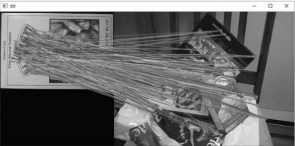
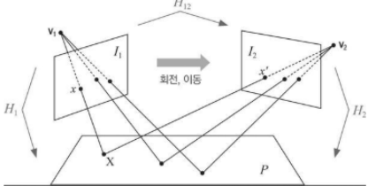
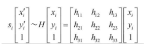
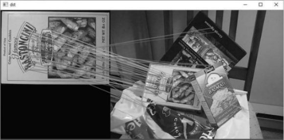

# 특징점 매칭

두 영상에서 추출한 `특징점 기술자를 비교`하여 `서로 비슷한 특징점`을 찾는 것   
크기 불변 특징점으로부터 구현 기술자 매칭 시, `크기와 회전에 강한` 영상 매칭 수행   
특징점 매칭 정보를 저장 시, [DMatch](https://docs.opencv.org/master/d4/de0/classcv_1_1DMatch.html) 클래스 사용
- 한 장의 영상에서 추출한 특징점과 다른 한 장의 영상, 또는 여러 영상에서 추출한 특징점 사이의 매칭 정보를 표현
- 두 키포인트 기술자가 얼마나 차이가 나는지를 나타내는 매칭 척도의 역할
- 두 특징점이 유사하면 distance는 0에 근접
  - 거리 계산시 유클리드 거리로 주로 계산
  - 이진 기술자끼리는 해밍 거리로 계산   


## 전수 조사 방법

[BFMatcher](https://docs.opencv.org/master/d3/da1/classcv_1_1BFMatcher.html)

전수 조사를 통해 확인   
특징점 개수가 늘어날수록 거리 계산 횟수가 급격하게 늘어남   
SIFT, SURF, KAZE 알고리즘 -> NORM_L2, NORM_L1 상수 사용   
ORB, BRIEF, AKAZE 알고리즘 -> NORM_HAMMING 상수 사용

## FLANN 기반 방법

[FlannBasedMatcher](https://docs.opencv.org/master/dc/de2/classcv_1_1FlannBasedMatcher.html)

근사화된 최근방 이웃(ANN: Approximate Nearest Neighbors) 사용   
가장 거리가 작은 특징점을 찾지 못할 수 있으나 `매우 빠름`   
L2 Norm 거리 측정방식 사용 -> 이진 기술자에서는 사용 불가

**키포인트 매칭 예시**


## 호모그래피

[findHomography](https://docs.opencv.org/master/d9/d0c/group__calib3d.html#gafd3ef89257e27d5235f4467cbb1b6a63)

3차원 공간상의 평면을 서로 다른 시점에서 바라봤을 때 획득되는 영상 사이의 관계 == 투시 변환   


**코드:**
c++:

```cpp
Mat cv::findHomography	(	InputArray 	srcPoints,
                          InputArray 	dstPoints,
                          int 	method = 0,
                          double 	ransacReprojThreshold = 3,
                          OutputArray 	mask = noArray(),
                          const int 	maxIters = 2000,
                          const double 	confidence = 0.995 
                          )	
```

두 평면 위에 있는 점들을 투영 변환하는 3X3 호모그래피 행렬 반환함   

Method 인자에 0을 지정 시 입력 점과 출력 점을 모두 사용하는 최소자승법으로 계산 -> 이상치(Outlier)가 많을 경우 제대로 동작 안함
- Method를 LMEDS, RANSAC, RHO로 설정하면 정상 작동
- LMEDS는 이상치 50% 이하, RANSAC, RHO는 이상치 50% 이상에서도 동작을 잘 함   

