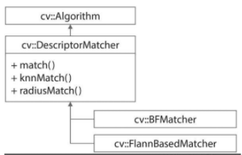

# 특징점 매칭

두 영상에서 추출한 `특징점 기술자를 비교`하여 `서로 비슷한 특징점`을 찾는 것   
크기 불변 특징점으로부터 구현 기술자 매칭 시, `크기와 회전에 강한` 영상 매칭 수행   
특징점 매칭 정보를 저장 시, [DMatch](https://docs.opencv.org/master/d4/de0/classcv_1_1DMatch.html) 클래스 사용
- 한 장의 영상에서 추출한 특징점과 다른 한 장의 영상, 또는 여러 영상에서 추출한 특징점 사이의 매칭 정보를 표현
- 두 키포인트 기술자가 얼마나 차이가 나는지를 나타내는 매칭 척도의 역할
- 두 특징점이 유사하면 distance는 0에 근접
  - 거리 계산시 유클리드 거리로 주로 계산
  - 이진 기술자끼리는 해밍 거리로 계산

## 전수 조사 방법

## FLANN 기반 방법

- Brute-Force: 모든 기술자 집합의 거리를 조사
- Fast Library approximate nearest neighbors: 근사화된 최근방 이웃을 구현한 라이브러리

Homography: 3차원 공간상의 평면을 서로 다른 시점에서 바라봤을 때 획득되는 영상 사이의 관계. 투시 변환과 같다.
