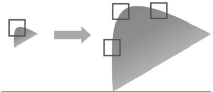
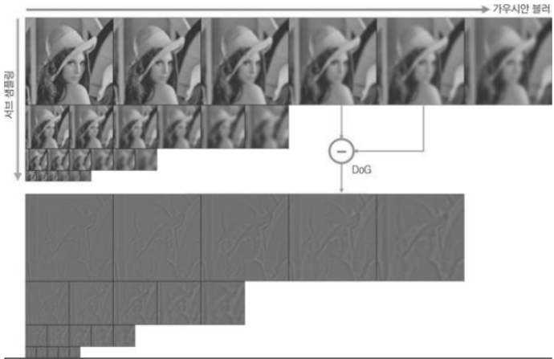
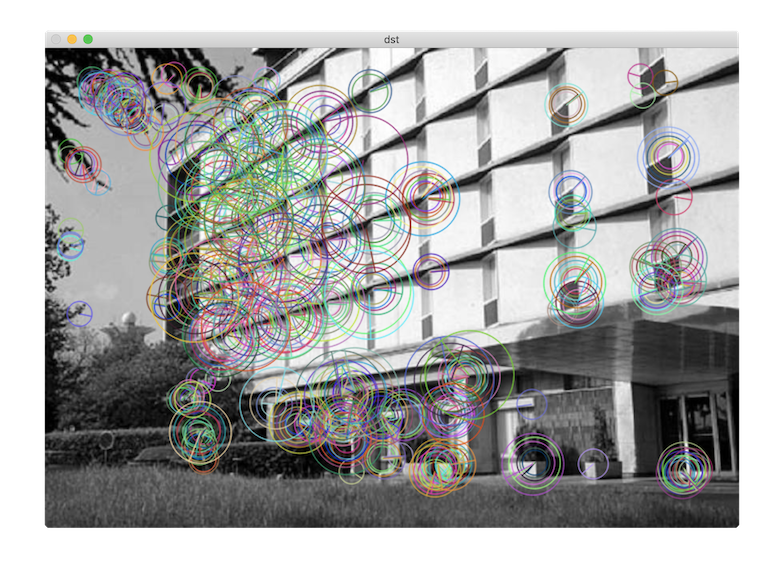

# 크기 불변 특징점 검출

## 크기 불변 특징 변환(Scale Invariant Feature Transform)

영상 확대 시, 코너는 더 이상 코너로 검출되지 않음   
- 크기가 다른 두 객체 영상에서 코너 점을 이용한 위치 찾기가 어려움   

- 크기 불변 특징 변환을 통해 해결
영상의 크기 변화에 무관하게 특징점 추출을 위해 스케일 스페이스(여러 표준 편차로 가우시안 블러링 적용한 영상 집합) 구성   
- 인접한 가우시안 블러링 영상끼리의 `차영상(DOG: Difference of Gaussian)`
- 지역 극값 위치를 특징점으로 사용
- 에지 성분이 강하거나 명암비가 낮은 지점은 특징점에서 제외   

**예시**



특징점: [KeyPoint](https://docs.opencv.org/master/d2/d29/classcv_1_1KeyPoint.html)



```bash
keypoints.size(): 500 # 500개 특징점
desc.size(): [32 x 500] # 기술자 행렬 500행, 32열
```
