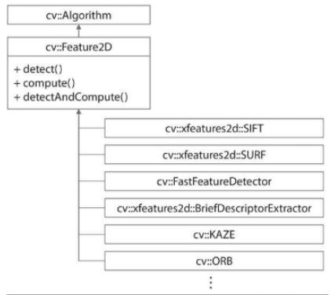

# 크기 불변 특징점 검출

## 크기 불변 특징 변환(Scale Invariant Feature Transform)

영상 확대 시, 코너는 더 이상 코너로 검출되지 않음   
- 크기가 다른 두 객체 영상에서 코너 점을 이용한 위치 찾기가 어려움   

- 크기 불변 특징 변환을 통해 해결
영상의 크기 변화에 무관하게 특징점 추출을 위해 스케일 스페이스(여러 표준 편차로 가우시안 블러링 적용한 영상 집합) 구성   
- 인접한 가우시안 블러링 영상끼리의 `차영상(DOG: Difference of Gaussian)`
- 지역 극값 위치를 특징점으로 사용
- 에지 성분이 강하거나 명암비가 낮은 지점은 특징점에서 제외  
영상 크기, 회전, 촬영 시점 변화, 잡음, 조명 변화에도 강하게 동작

## 기술자 계산 방법

특징 벡터(Feature vector): 특징점 기술자는 특징점 주변 영상의 특성을 여러 개의 실수 값으로 표현한 것   
서로 같은 특징점에서 추출된 기술자는 `실수 값 구성이 일치`해야 한다   
특징점 부근의 영상으로부터 그래디언트 방향 히스토그램을 추출
- 특징점 방에서 특징점의 주된 방향 성분 계산
- 방향만큼 회전한 부분 영상으로부터 128개의 빈으로 구성된 그래디언트 방향 히스토그램 계산
- 각 빈 값은 float
- 하나의 SIFT 특징점은 512바이트 크기의 기술자

## SIFT 개량 알고리즘

SURF : SIFT에서 DoG를 `단순 이진 패턴`으로 근사화하여 속도 향상   
KAZE : 가우시안 함수 대신 비등방선 확산 필터 사용하여 비선형 스케일 스페이스를 구축
- 객체의 윤곽을 보전하여 블러링, 크기, 회전, 잡음에도 특징점 찾는 성능이 좋음

##### 단점

위의 알고리즘은 기술자가 128 또는 64개의 실수로 이루어져 메모리 사용량이 많음   
실시간 응용에서 사용하기 어려움

ORB : 이진수로 구성된 기술자를 사용하는 알고리즘(FAST + BRIEF)
- 점진적으로 축소한 피라미드 영상을 구축하여 특징점 추출

- FAST 기반으로 특징점 구한 후 코너 방향 성분 계산
- 위의 방향 성분을 통해 BRIEF 계산에 필요한 점들의 위치 보정 후 BRIEF 기술자를 계산
- 256개의 크기 비교 픽셀 쌍을 사용하여 이진 기술자를 구성
- 이진 기술자는 `해밍 거리` 사용

**해밍 거리**

두 기술자의 비트 단위 배타적 논리합 연산 후, 비트 값이 1인 개수를 세는 방식

기타 알고리즘으로 BRISK, AKAZE, FREAK이 이진 기술자를 사용

## 특징점 검출과 기술

[KeyPoint](https://docs.opencv.org/master/d2/d29/classcv_1_1KeyPoint.html)

키포인트 클래스는 특징점의 좌표뿐만 아니라 특징점 검출 시 고려한 주변 영역의 크기, 주된 방향, 옥타브 정보 등을 포함함   
detect(), compute(), detectAndCompute() 가상 멤버 함수 포함
- 상속 받는 구현 클래스에서 실제 구현됨
- 각 구현 클래스 별로 사용 가능한 가상 멤버 함수가 다름

**예시**

