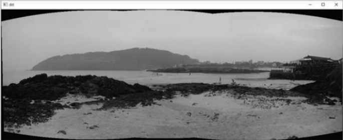

# 영상 이어 붙이기

## 파노라마(Panorama) 영상

여러 장의 영상을 서로 이어 붙여서 `하나의 큰 영상`을 만드는 기법  
사용할 영상 간 일정 비율 이상의 `겹치는 영역` 존재   
위치를 분간 가능한 `유효한 특징점`이 존재해야 함   
파노라마 영상 제작 순서   
- 특징점 검출 -> 매칭 수행을 통한 호모그래피 구하기 -> 호모그래피 행렬을 통한 입력 영상 변형 -> 이어 붙이기(블랜딩 처리 포함)

[Stitcher](https://docs.opencv.org/master/d2/d8d/classcv_1_1Stitcher.html)

**예시**

