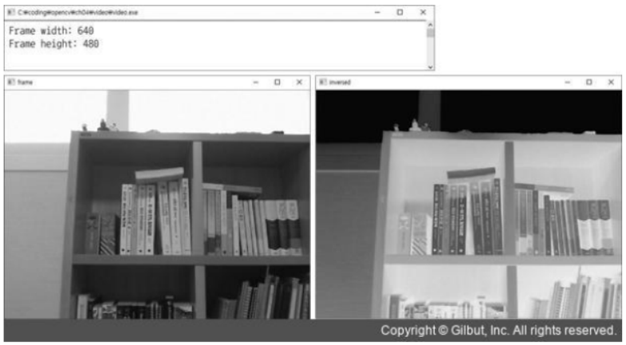
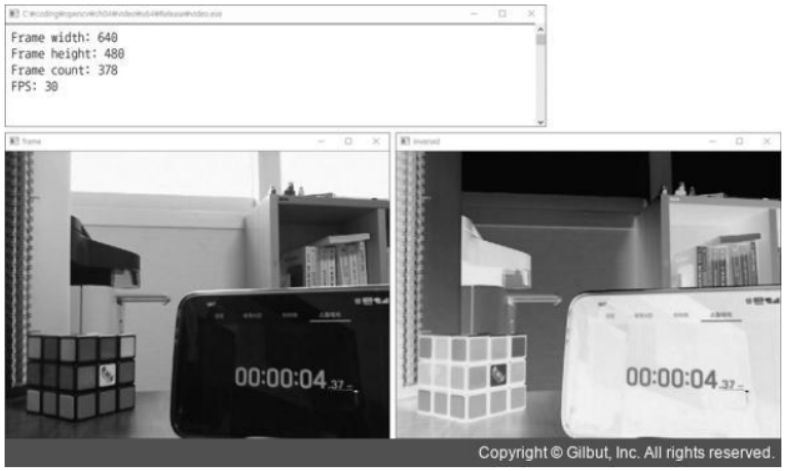
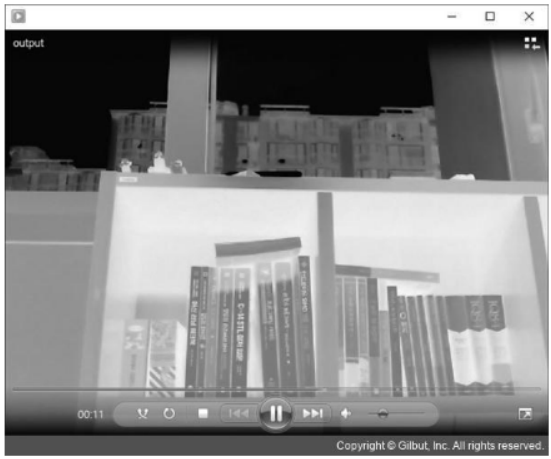

# 4. OpenCV 주요 기능

## 4.1 카메라와 동영상 파일 다루기

영상을 관리 할 수 있는 `VideoCapture` 클래스를 중심으로 카메라 입력 처리 방법, 동영상 입력 처리 방법 및 저장 방법 등에 대해 소개한다.

### 4.1.1 VideoCapture 클래스

 OpenCV 에서는 `VideoCapture`라는 하나의 클래스를 이용하여 카메라 또는 동영상 파일로부터 정지된 영상 프레임을 받아 올 수 있다.

```c++
class VideoCapture
{
    public:
         VideoCapture();
         VideoCapture(const String& filename, int apiPreference = CAP_ANY);
         VideoCapture(int index, int apiPreference = CAP_ANY);
         virtual ~VideoCapture();

         virtual bool open(const String& filename, int apiPreference = CAP_ANY);
         virtual bool open(int index, int apiPreference = CAP_ANY);
         virtual bool isOpened() const;
         virtual void release();

         virtual bool grab();
         virtual bool retrieve(Outputarray image, int flag = 0);

         virtual VideoCapture& operator >> (Mat& image);
         virtual bool read(OutputArray image);

         virtual bool set(int propId, double value);
         virtual double get(int propId) const;
    ...
}
```

 #### VideoCapture::open()

 `VideoCapture::open()`을 이용해 동영상 파일을 불러오거나 카메라 입력 영상을 불러올 수 있다.

 ```c++
VideoCapture::VideCapture(const String& filename, int apiPreference = CAP_ANY);
bool VideoCapture::open(const String& filename, int apiPreference = CAP_ANY);
 ```
 변수 | 의미 
 ---|:---
 `filename` | 동영상 파일 이름
 `apiPreference` | 사용할 비디오 캡처 API 백엔드
 반환값 | (`VideoCapture::open()`함수)열기가 성공하면 true, 실패하면 false

 먼저 동영상 파일을 불러오는 방법이다. 동영상 파일을 불러오려면 `VideoCapture` 객체를 생성할 때 생성자에 동영상 파일 이름을 지정하거나 객체 생성 후 `VideoCapture::open()` 멤버 함수를 호출해야 한다. `filename` 인자에는 동영상 파일 확장자를 갖는 동영상 파일, 사진 혹은 비디오 스트림 URL을 지정하여 사용할 수 있다.

 ```c++
VideoCapture::VideCapture(int index, int apiPreference = CAP_ANY);
bool VideoCapture::open(int index, int apiPreference = CAP_ANY);
 ```
 변수 | 의미 
 ---|:---
 `index` | 카메라와 장치 사용 방식 지정 번호
 `apiPreference` | 사용할 카메라 캡처 API 백엔드
 반환값 | (`VideoCapture::open()`함수)열기가 성공하면 true, 실패하면 false

 카메라 장치를 사용하기 위해서도 `VideoCapture` 객체를 생성해야 한다. `VideoCapture::open()` 함수에 전달하는 index는 다음과 같은 형태로 구성된다

 ```c++
 index = camera_id + domain_offset_id
 ```

 카메라 또는 동영상 파일을 연 다음에는 `VideoCapture::isOpened()` 멤버 함수를 이용해 성공적으로 열었는지 확인할 수 있다. 카메라 장치 혹은 동영상 파일의 사용이 끝나면 `VideoCapture::release()` 멤버 함수를 호출하여 사용하던 자원을 해제할 수 있다. `VideoCapture::release()` 함수의 경우 소멸자에서 자동 호출한다.

 #### VideoCapture::read()

 ```c++
 VideoCapture& VideoCapture::operator >> (Mat& image);
 bool VideoCapture::read(OutputArray image);
 ```
  변수 | 의미 
 ---|:---
 `image` | 다음 비디오 프레임. 만약 더 가져올 프레임이 없다면 비어 있는 행렬로 설정된다.
 반환값 | 프레임을 받아 올 수 없으면 false

`>>` 연산자는 `VideoCapture::read()`함수를 호출하는 형태로 구현되어 있다. `VideoCapture::read()`함수는 `VideoCapture::grab()`함수와 `VideoCapture::retrieve()`함수를 합쳐놓은 것이다.
함수|의미
---|:---
`VideoCapture::grab()` | 카메라 장치에 다음 프레임을 획득하라는 명령을 내린다.
`VideoCapture::retrieve()` | 획득한 프레임을 실제로 받아온다.

 #### VideoCapture::get()

 ```c++
 double VideoCapture::get(int propId) const;
 ```
  변수 | 의미 
 ---|:---
 `propId` | 속성 ID. VideoCaptureProperties 열거형 중 하나를 지정한다.
 반환값 | 지정한 속성 값. 만약 지정한 속성을 얻을 수 없으면 0을 반환한다.

 `VideoCapture::get()` 함수는 지정한 속성 ID에 해당하는 속성 값을 반환한다. 이 함수는 double 자료형으로 속성 값을 반환하는데, 만일 정수형 변수에 저장하려면 `cvRound()` 함수를 사용하는게 좋다.

 #### VideoCapture::set()

  ```c++
 double VideoCapture::set(int propId, double value);
 ```
  변수 | 의미 
 ---|:---
 `propId` | 속성 ID. VideoCaptureProperties 열거형 중 하나를 지정한다.
 `value` | 지정할 속성 값
 반환값 | 속성 지정이 가능하면 true, 아니면 false를 반환한다.

 `VideoCapture::set()` 함수는 지정한 속성 ID에 해당하는 속성 값을 `value`로 지정한다.

 ### 4.1.2 카메라 입력 처리하기

 ```c++
 void camera_in()
 {
     VideoCapture cap(0);

     if(!cap.isOpened()) {
         cerr << "Camera open failed!" << endl;
         return;
     }

     cout << "Frame width : " << cvRound(cap.get(CAP_PROP_FRAME_WIDTH)) << endl;
     cout << "Frame height : " << cvRound(cap.get(CAP_PROP_FRAME_HEIGHT)) << endl;

     Mat frame, inversed;
     while (true) {
         cap >> frame;
         if (frame.empty())
            break;

         inversed = ~frame;

         imshow("frame", frame);
         imshow("inversed", inversed);

         if (waitKey(10) == 27) // ESC key
            break;
     }

     destroyAllWindows();
 }
 ```
 행 번호 | 의미
 ---|:---
 3 | `VideoCapture` 객체를 생성하고, 컴퓨터에 연결된 기본 카메라를 사용하도록 설정
 5~8 | 카메라 장치가 성공적으로 열리지 않았따면 에러 메시지를 출력하고 함수를 종료
 10~11 | 카메라 속성 중에서 프레임 가로 크기와 세로 크기를 콘솔 창에 출력
 13 | `Mat` 타입의 변수 `frame`과 `inversed`를 선언
 15~17 | 카메라 장치로부터 한 프레임을 받아 와서 `frame` 변수에 저장. 만약 해당 프레임 영상이 비어 있으면 while 루프를 빠져나감
 19 | 현재 프레임을 반전하여 `inversed` 변수에 저장
 21~22 | `frame`과 `inversed`에 저장된 정지 영상을 화면에 출력
 24~25 | 사용자로부터 10ms 시간 동안 키보드 입력 대기. 만일 키값이 27 `ESC`면 while 루프를 빠져나감
 28 | 모든 창을 닫느다
 29 | `camera_in()` 함수가 종료될 때 `cap` 변수가 소멸되면서 자동으로 카메라 장치를 닫기 때문에 명시적인 `cap.release()` 함수 호출은 생략

 위 코드의 `camera_in()` 함수 실행 결과는 다음과 같다. 
 

 ### 4.1.3 동영상 파일 처리하기

 ```c++
 void video_in()
 {
     VideoCapture cap("stopWatch.avi");

     if (!cap.isOpened()) {
         cerr << "Video open failed!" << endl;
         return;
     }

     cout << "Frame width" << cvRound(cap.get(CAP_PROP_FRAME_WIDTH)) << endl;
     cout << "Frame height" << cvRound(cap.get(CAP_PROP_FRAME_HEIGHT)) << endl;
     cout << "Frame count" << cvRound(cap.get(CAP_PROP_FRAME_COUNT)) << endl;

     double fps = cap.get(CAP_PROP_FPS);
     cout << "FPS : " << fps << endl;

     int delay = cvRound(1000 / fps);

     Mat frame, inversed;
     while (true) {
         cap >> frame;
         if (frame.empty())
            break;
         
         inversed = ~frame;

         imshow("frame", frame);
         imshow("inversed", inversed);

         if (waitKey(10) == 27) // ESC key
            break;
     }

     destroyAllWindows();
 }
 ```
 행 번호 | 의미
 ---|:---
 3 | stopwatch.avi 파일을 불러와서 `cap` 객체를 생성
 10~12 | 비디오 프레임의 가로 세로 크기, 전체 프레임 수를 출력
 14~15 | 비디오 파일의 FPS 값을 받아 와서 출력
 17 | FPS 값으로부터 각 프레임 사이의 시간 간격 `delay`를 계산
 21~23 | 카메라 장치로부터 한 프레임을 받아 와서 `frame` 변수에 저장. 만약 해당 프레임 영상이 비어 있으면 while 루프를 빠져나감
 25 | 현재 프레임을 반전하여 `inversed` 변수에 저장
 27~28 | `frame`과 `inversed`에 젖아된 정지 영상을 화면에 출력
 30~31 | `delay` 시간만큼 키 입력을 기다리고, 만약 `ESC` 키가 눌리면 while 반복문을 빠져나감

 위 코드의 `video_in()` 함수 실행 결과는 다음과 같다.

 

 ### 4.1.4 동영상 파일 저장하기

 OpenCV 에서 동영상 파일을 생성하고 프레임을 저장하기 위해서는 `VideoWriter` 클래스를 사용해야한다.

 ```c++
 class VideoWriter
 {
     public:
         VideoWriter();
         VideoWriter(const String& filename, int fourcc, double fpse, Size frameSize, bool isColor = true);
         virtual ~VideoWriter();

         virtual bool open(const String& filename, int fourcc, double fpse, Size frameSize, bool isColor = true);
         virtual bool isOpened() const;
         virtual void release();

         virtual VideoWriter& operator << (const Mat& image);
         virtual void write(const Mat& image);

         virtual bool set(int propId, double value);
         virtual double get(int propId) const;

         static int fourcc(char c1, char c2, char c3, char c4);
         ...
 }
 ```

 #### VideoWriter::open()

 ```c++
 VideoWriter::VideoWriter(const String& filename, int fourcc, double fpse, Size frameSize, bool isColor = true);
 bool VideoWriter::open(const String& filename, int fourcc, double fpse, Size frameSize, bool isColor = true);
 ```
   변수 | 의미 
 ---|:---
 `filename` | 저장할 동영상 파일 이름
 `fourcc` | 동영상 압축 코덱을 표현하는 4-문자코드
 `fps` | 저장할 동영상의 초당 프레임 수
 `frameSize` | 동영상 프레임의 가로 및 세로 크기
 `isColor` | 이 값이 true이면 컬러 동영상으로 저장하고, false이면 그레이스케일 동영상으로 저장. 이 플래그는 Windows 운영체제에서만 지원
 반환값 | (`VideoWriter::open()`함수)열기가 성공하면 true, 실패하면 false

 위에서 `fourcc`는 four character code 의 약자이며 내 게의 문자로 구성된 코드이다. 이는 도영상 파일의 코덱, 압축 방식, 색상 혹은 픽셀 포멧등을 정의하는 정수 값이며, 코덱을 표현하는 네 개의 문자를 묶어서 생성한다. `VideoWriter::fourcc()` 함수를 사용하여 생성할 수 있다.

 #### VideoWriter::write()

 ```c++
 VideoWriter& VideoWriter::operator << (const Mat& image);
 void VideoWriter::write(InputArray image);
 ```
   변수 | 의미 
 ---|:---
 `image` | 추가할 프레임

 열려 있는 동영상 파일에 새로운 프레임을 추가하기 위해선 `<<` 연산자 재정의 또는 `VideoWriter::write()`함수를 사용한다. 이때 `image` 프레임 크기는 동영상 파일을 생성할 때 지정했던 프레임 크기와 같아야 한다. 또한 컬러 동영상 파일에 그레이스케일 영상을 추가하면 정상적으로 저장되지 않는다.

 ```c++
 void camera_in_video_out()
 {
     VideoCapture cap(0);

     if (!cap.isOpened()) {
         cerr << "Camera open failed!" << endl;
         return;
     }

     int w = cvRound(cap.get(CAP_PROP_FRAME_WIDTH));
     int h = cvRound(cap.get(CAP_PROP_FRAME_HEIGHT));

     double fps = cap.get(CAP_PRO_FPS);

     int fourcc = VideoWriter::fourcc('D', 'I', 'V', 'X');
     int delay = cvRound(1000 / fps);

     VideoWriter outputVideo("output.avi", fourcc, fps, Size(w,h));

     if (!outputVideo.isOpened()) {
         cout << "File openfailed!" << endl;
         return;
     }

     Mat frame, inversed;
     while (true) { 
         cap >> frame;
         if (frame.empty())
             break;
         
         inversed = ~frame;
         outputVideo << inversed;

         imshow("frame", frame);
         imshow("inversed", inversed);

         if (waitKey(delay) == 27)
             break;
     }

     destroyAllWindows();
 }
 ```
 행 번호 | 의미
 ---|:---
 3 | 시스템 기본 카메라를 사용
 10~12 | 카메라 프레임의 가로, 세로 크기, 카메라의 FPS 값을 받아옴
 14 | DivX MPEG-4 코덱에 해당하는 `fourcc` 코드를 생성
 15 | FPS 값으로부터 매 프레임 사이의 시간 간격을 밀리초 단위로 계산
 17 | 저장할 동영상 파일을 생성. 동영상 파일 이름은 output.avi
 26 | 카메라로부터 한 프레임을 받아 와 `frame`에 저장
 30 | 카메라 프레임을 반전하여 `inversed`에 저장
 31 | 반전된 카메라 프레임 영상 `inversed`를 출력 동영상에 추가

 