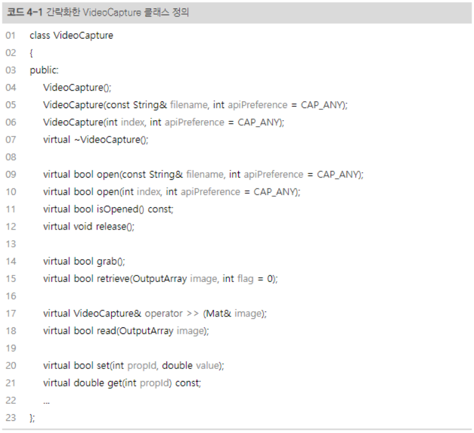

# 4. OpenCV 주요 기능

## 4.1 카메라와 동영상 파일 다루기

영상을 관리 할 수 있는 `VideoCapture` 클래스를 중심으로 카메라 입력 처리 방법, 동영상 입력 처리 방법 및 저장 방법 등에 대해 소개한다.

### 4.1.1 VideoCapture 클래스

 OpenCV 에서는 `VideoCapture`라는 하나의 클래스를 이용하여 카메라 또는 동영상 파일로부터 정지된 영상 프레임을 받아 올 수 있다.

 

 #### VideoCapture::open()

 `VideoCapture::open()`을 이용해 동영상 파일을 불러오거나 카메라 입력 영상을 불러올 수 있다.

 ```c++
VideoCapture::VideCapture(const String& filename, int apiPreference = CAP_ANY);
bool VideoCapture::open(const String& filename, int apiPreference = CAP_ANY);
 ```
 변수 | 의미 
 ---|:---
 `filename` | 동영상 파일 이름
 `apiPreference` | 사용할 비디오 캡처 API 백엔드
 반환값 | (`VideoCapture::open()`함수)열기가 성공하면 true, 실패하면 false

 먼저 동영상 파일을 불러오는 방법이다. 동영상 파일을 불러오려면 `VideoCapture` 객체를 생성할 때 생성자에 동영상 파일 이름을 지정하거나 객체 생성 후 `VideoCapture::open()` 멤버 함수를 호출해야 한다. `filename` 인자에는 동영상 파일 확장자를 갖는 동영상 파일, 